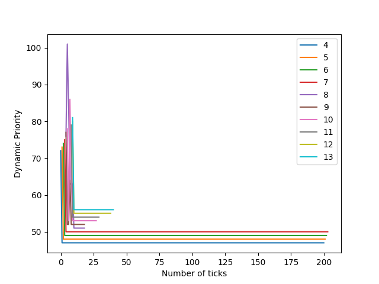

# xv6

## Priority-based Scheduling

This is a priority-based scheduling policy that chooses the process with the highest priority to execute. If two or more processes have the same priority, we break the tie using the number of times the process has been scheduled. If the tie persists, use the process's start time to break it (processes with lower start times are scheduled earlier).

We have static priority and dynamic priority here. Dynamic priority determines scheduling by varying with running, waiting and sleeping time. Dynamic priority is calculated using static priority.


#### Implementation

-   Once again, we use a for loop to find the process with the highest priority (lowest dynamic priority),  In case two or more processes have the same priority, we use the number of times the process has been scheduled to break the tie. If the tie remains, use the start-time of the process to break the tie(processes with lower start times should be scheduled further). Then the selected process is scheduled to run.

-   The number of ticks,stime,runtime,wtime,RBI and Dynamic Priority are stored in struct proc::s. In the Updatetime() function, the values of these parameters are updated accordingly.
In the same loop i have updated the RBI and Dynamic Priority of each process.

-   struct proc'  stores the static priority (50 by default). When the process to be scheduled is selected, the RBI and dynamic priority are calculated in the loop.

-   A process's static priority can be modified using the 'set priority()' system call. In this function, i have updated the static priority of the process and also set the RBI to 25 and Dynamic Priority of the process accordingly and also returns the old priority.

```bash
setpriority [priority] [pid]
```


# Effectiveness of Static Priority (SP): 
### Observation:
- SP represents the inherent priority of a process which ranges from 0 to 100. Lower SP values indicate higher priority for scheduling. It's default value for each process is 50. Analysis: Decreasing the SP(Static priority) of a process increases its priority, making it more likely to be scheduled. Increasing the SP lowers the priority, potentially delaying the process's execution. Outcome : So we can make a process to get scheduled fast or gets delayed by using SP(Static priority) parameter of a process by using set_priority system call.

# Effectiveness of RBI (RTime, WTime, STime):
### Observation:
- RBI is a weighted sum of Running Time (RTime), Sleeping Time (STime), and Waiting Time (WTime). RBI adjusts the dynamic priority based on recent behavior. It's default value will be 25 for each process.
### Running Time (RTime):
- The total time the process has been running since it was last scheduled. A process with high RTime might have a higher RBI, indicating a potential increase in dynamic priority and thus overall decrease the chances of that process to get rescheduled.
### Sleeping Time (STime): 
- The total time the process has spent sleeping (i.e., blocked and not using CPU time) since it was last scheduled. High STime decreases the RBI, potentially reducing dynamic priority which increases the chances of that process to get rescheduled with respect to others.
### Waiting Time (WTime):
- The total time the process has spent in the ready queue waiting to be scheduled. A process waiting for a long time may have a lower RBI as it is with minus sign in numerator so decreasing the RBI value, and decreasing the dynamic Priority and thus overall increasing priority to get scheduled.
### Weighted Sum:
- The weighted sum captures the overall recent behavior impact on priority.


# Analysis of PBS (DP):

PBS Analysis:



## Bibliography

1. *ChatGPT Documentation:*
   - [OpenAI ChatGPT Documentation](https://platform.openai.com/docs/guides/chat)
   - [OpenAI GPT-3.5 Model Documentation](https://platform.openai.com/docs/models/gpt)

2. *GitBook.io Guides:*
   - [Markdown Guide on GitBook.io](https://xiayingp.gitbook.io/build_a_os/hardware-device-assembly/start-xv6-and-the-first-process)

3. *Github Co-Pilot:*
    - [Markdown Guide on Github-Co-Pilot Documentation](https://docs.github.com/en/copilot)
    